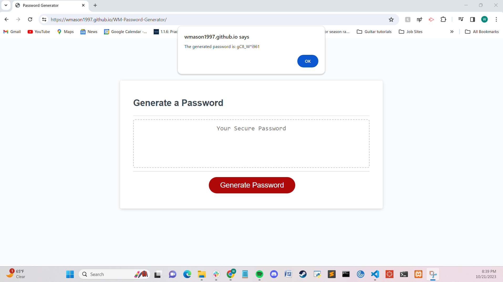

# WM-Password-Generator #

## Description ##

The starter code to be refactored was from the Develop folder within the 02-Challenge folder within the 03-JavaScript folder within the UCSD-VIRT-FSF-PT-09-2023-U-LOLC GitLab repository. On GitLab, it says that user mvpache authored the repository.

I have refactored the script.js file to give the deployed website the same functionality and similar prompts as the example from lecture given by Michael. I also had my password generator return the prompted password in both the window alert boxes and the placeholder location on the webpage.

## Credits ##

I used this link - https://stackoverflow.com/questions/7820683/convert-boolean-result-into-number-integer - to figure out how to use the booleans of the included sets to change the length of my for loop afer the hardcoded inclusion of selected sets section.

I met with tutor Sangeetha Kaliaperumal on October 22, 2023 to hammer out the final details of my project.

I asked ChatGPT to help me figure out the required escape characters for the special characters that were giving my VS code a hard time. The double quote " and the backslash \ each needed a backslash \ to precede them. I got the [list of password special characters](https://www.owasp.org/index.php/Password_special_characters) from the OWASP Foundation from the README in the source code.

## Screenshots ##

## Link to Deployed Application ##
[William Mason Password Generator](https://wmason1997.github.io/WM-Password-Generator/)